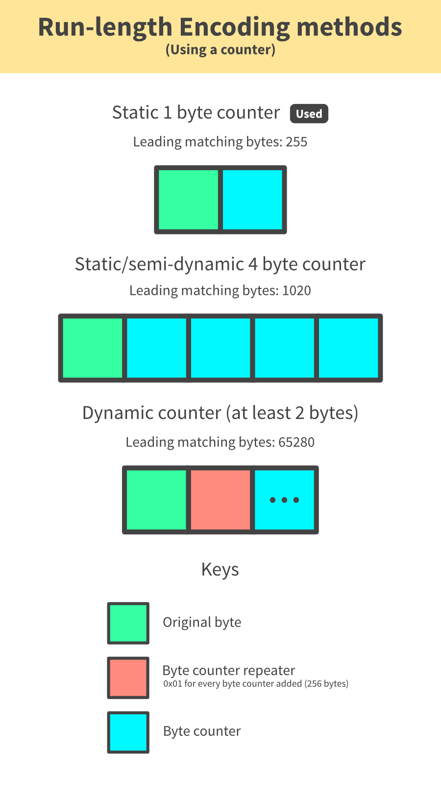

# RLE Compressor

## About

Run-length encoding compressor and decompressor but barebones.

This was created for the purposes of trying out something different. In this case, this tool does not have *any* good practical use. So please, for your own sake, do not be that one person and simply use it for anything important as if it is StackOverflow content. There are better suited RLE compression tools out there (although improvements may need to be made to improve robustness), if that is what you are after. There are also much better modern and efficient ways of compressing data.

However, if you are wanting to see how RLE works in its most basic form, improve upon it (directly or port it over) as an exercise or want to see how parts of the tool work to potentially make use of in your own projects.. that is mainly why it was decided to put it up on this website.

TL;DR: Intended to be used for educational purposes. Strongly advised not to use with any important applications.

## Features

- RLE Compression
- RLE Decompression
- Storage check
- Exception handling and validation, everywhere
- ... did I forget to mention that it is barebones?

## Prerequisites

- Python 3.3 or newer

## Limitations

- Counter is single-byte, so cannot have more than 256 of the same byte together
  - For more information, refer to the infographic below the README.

## Usage

### Syntax:
```bash
rlecompressor.py [c (compress) | d (decompress)] [input file] [output file]
```

### Examples:

Compress:
```bash
rlecompressor.py c inputfile.bin compressed.bin
```

Decompress:
```bash
rlecompressor.py d compressed.bin decompressed.bin
```

## More information

To better demonstrate what could be done to improve how compression is done, here is an infographic with a few methods.


